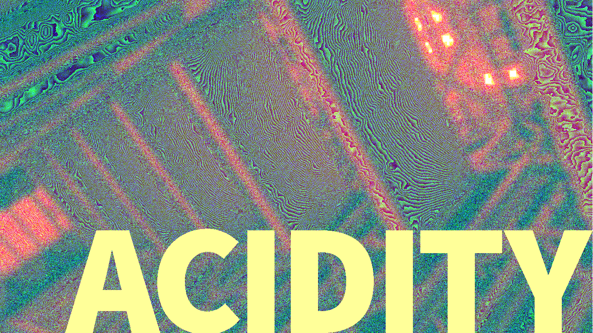

## Installation

Requires [Crystal](https://crystal-lang.org/).

```bash
git clone https://github.com/czycha/acidity.git
cd acidity/
shards build
```

You may want to add `acidity/bin/` to your path to use the script globally.

## Usage

```bash
acidity input.png output.png [radius]
```

### Notes

- [Currently only supports loading and writing to PNGs.](https://github.com/czycha/acidity/issues/3)
- Radius is an optional, positive, non-zero integer. Defaults to 9. Larger numbers take longer, but have more interesting results.

## Contributors

- [James Anthony Bruno](https://github.com/czycha/) - creator, maintainer
